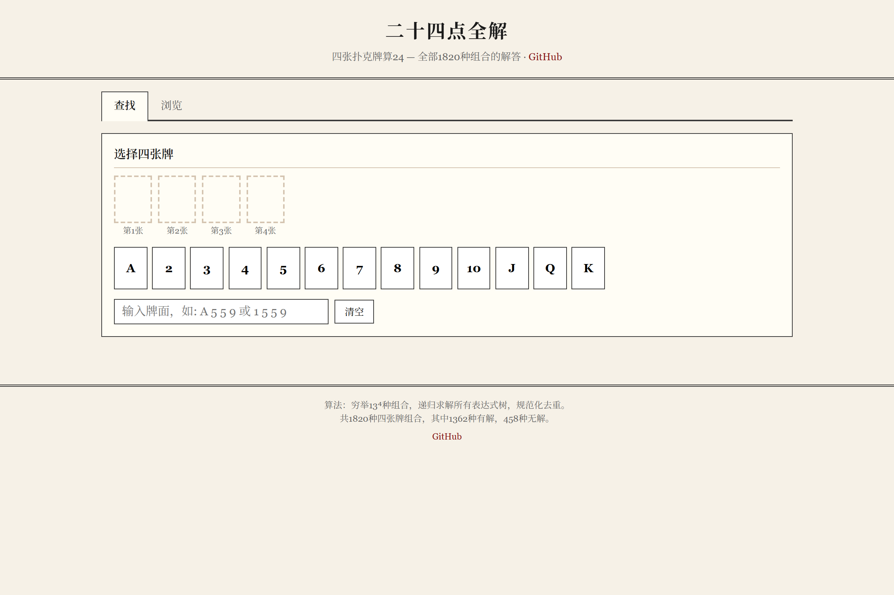

# 24点全解

四张扑克牌算24 — 全部1820种组合的解答。

🔗 **在线使用**：https://holynova.github.io/24points/

## 功能

- 输入任意4张牌（A~K），查看所有解法
- 浏览全部1820种组合，按解法数排序
- 点击表达式可复制
- 移动端和PC端自适应

## 算法

穷举所有4张牌组合，递归枚举表达式树，通过加减法统一收集排序、乘除法统一收集排序、恒等消除（×1, ÷1, +0, -0）等规范化手段去重，得到3713条不重复的表达式。

## 本地运行

直接打开 `index.html` 即可，无需服务器。

## License

MIT
